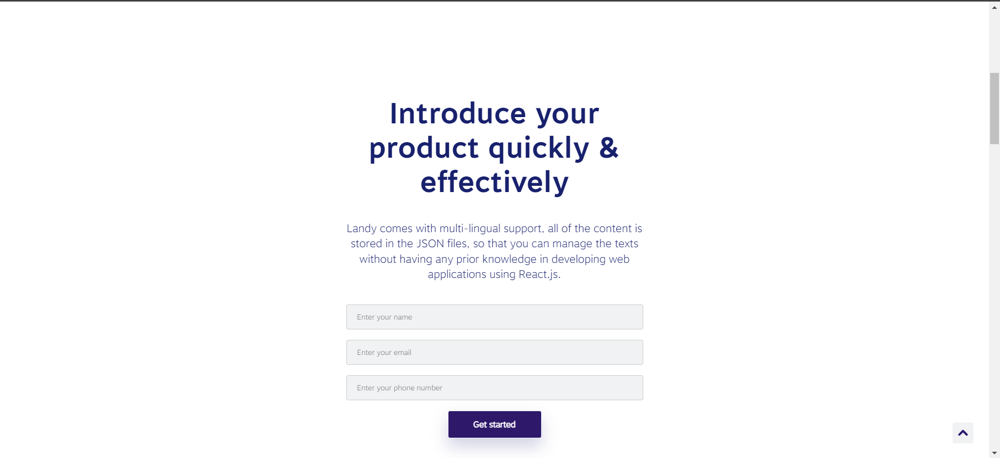
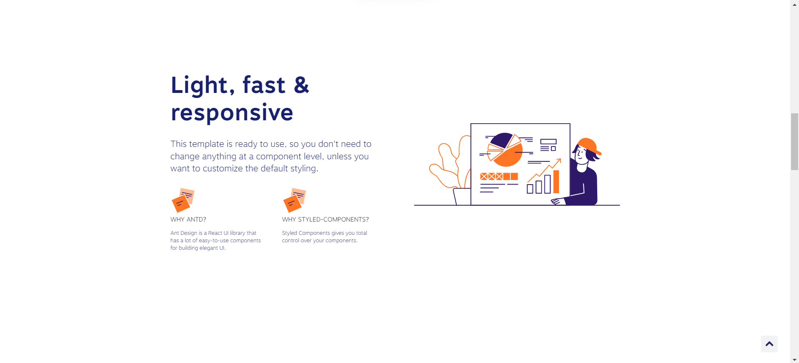
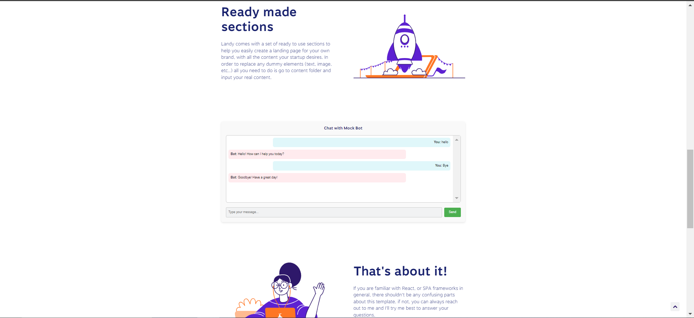

# Interactive Frontend Web App - Vinex interview selection test

# Candidate:
```bash
- Huỳnh Lương Nhựt Toàn
- https://www.linkedin.com/in/thomashuynhqn/
- Phone/Zalo: (+84)394-069-371
```

# Company - Vinex
- Task 1


- Task 2


- Task 3


## **Table of Contents**

- [Installation](#installation)
- [Usage](#usage)
- [Technologies Used](#technologies-used)
- [Contributing](#contributing)
- [License](#license)

## **Installation**

1. Clone the repository:
- git clone https://github.com/thomashuynhqn/Thomas-Huynh-Vinex-Web-App.git
- cd Thomas-Huynh-Vinex-Web-App


2. Install dependencies:
- npm install

3. Run the development server:
- npm run start

## **Usage**

- User Info Input: Use the input to print the results after click the button
- Chatbox: Mock the use of the chatbox, I don't have API so only use "hello, help and goodbye" to interact with the chat bot

## **Technologies Used**

- React: JavaScript library for building user interfaces.
- Style-components: Style components of CSS in Ts or Js files
- Ant Design: React UI library for building user interfaces.
- JavaScript (ES6+): Modern JavaScript features for application logic.

## **Contributing**

1. Fork the repository.
2.  Create a new branch: git checkout -b feature/your-feature-name.
3. Make your changes and commit them: git commit -m 'Add some feature'.
4. Push to the branch: git push origin feature/your-feature-name.
5. Open a pull request.

## **License**

NONE